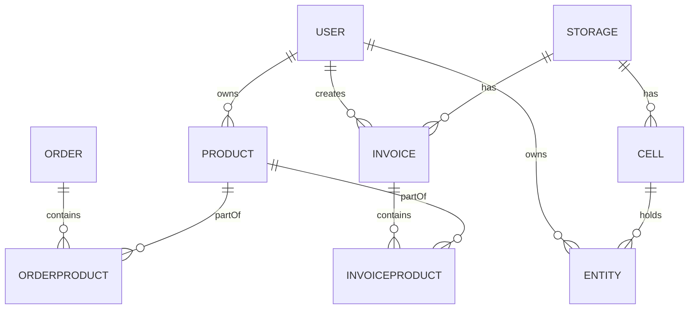

### ER-диаграмма (из `service/prisma/schema.prisma`)

```mermaid
erDiagram
  USER ||--o{ PRODUCT : owns
  USER ||--o{ INVOICE : creates
  USER ||--o{ ENTITY : owns
  STORAGE ||--o{ CELL : has
  STORAGE ||--o{ INVOICE : has
  ORDER ||--o{ ORDERPRODUCT : contains
  PRODUCT ||--o{ ORDERPRODUCT : partOf
  INVOICE ||--o{ INVOICEPRODUCT : contains
  PRODUCT ||--o{ INVOICEPRODUCT : partOf
  CELL ||--o{ ENTITY : holds
```

Ключевые поля и связи отражены согласно `schema.prisma` (Roles, OrderStatuses, InvoiceStatuses и т.д.).

