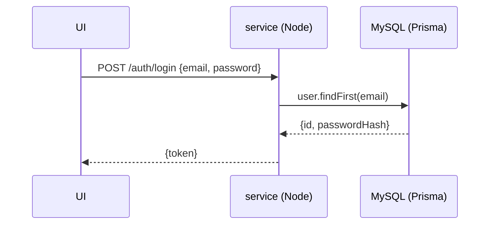
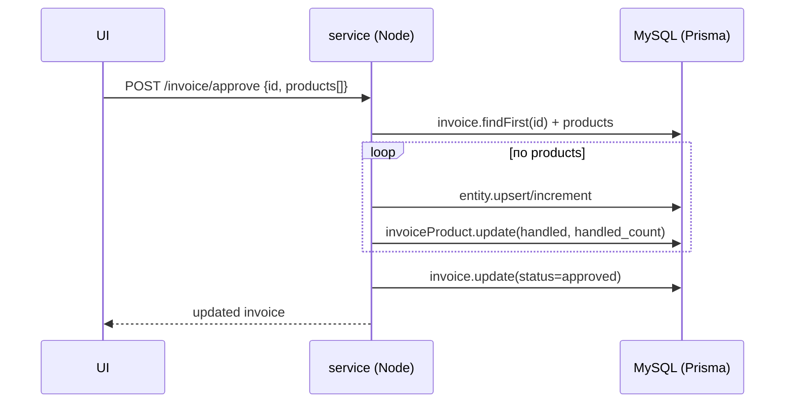
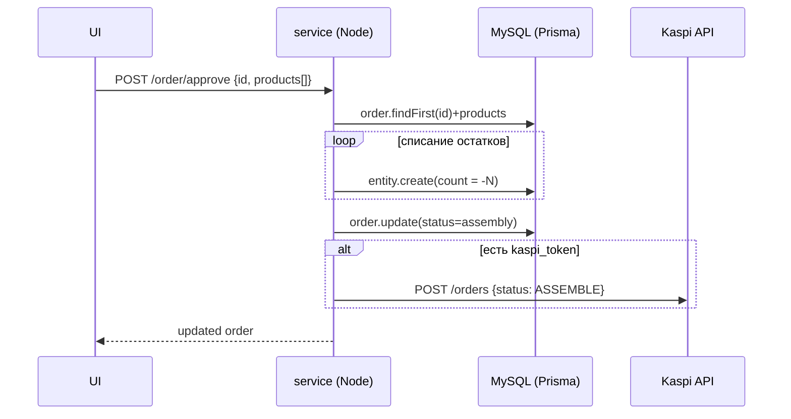
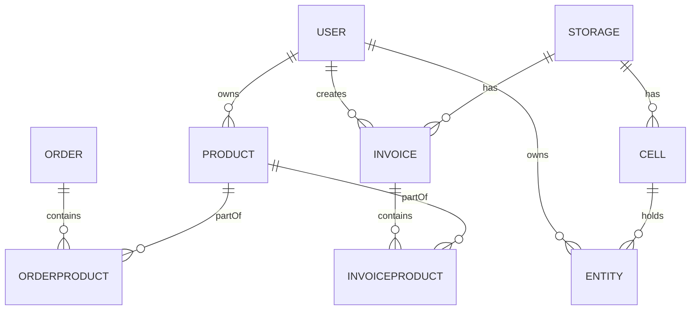

## Архитектура и дизайн: Sitemap и соответствие Use Case

Цель работы: построить структурную карту приложения (sitemap) на основе ключевых сценариев ЛР1 и зафиксировать соответствие страниц и сценариев, дополнив диаграммами высокого уровня.

### 1) Sitemap (структурная карта приложения)

```mermaid
flowchart TD
  A[Main / Главная] --> AU[Auth / Вход]
  A --> D[Dashboard]
  A --> P[Products / Товары]
  A --> O[Orders / Заказы]
  A --> I[Invoices / Накладные]
  A --> S[Storage / Склады]
  A --> C[Cells / Ячейки]
  A --> E[Entities / Остатки]
  A --> ST[Settings / Настройки]

  AU --> AU1[Login]

  P --> P1[Мои товары]
  P --> P2[Поиск]
  P --> P3[Создать товар]
  P --> P4[Обновить/Удалить]
  P --> P5[Импорт из Excel]

  O --> O1[Мои заказы]
  O --> O2[Создать заказ]
  O --> O3[Подтвердить (assembly)]
  O --> O4[Упакован (packed)]

  I --> I1[Список накладных]
  I --> I2[Создать]
  I --> I3[Утвердить]
  I --> I4[Отклонить]
  I --> I5[В доставке]

  S --> S1[Список складов]
  S --> S2[Создать/Обновить/Удалить]
  S --> S3[Распределить товары по ячейкам]

  C --> C1[Список ячеек]
  C --> C2[Создать/Обновить/Удалить]

  E --> E1[Мои остатки]

  ST --> ST1[Kaspi ключ]
  ST --> ST2[Смена пароля]
```

### 2) Соответствие страниц — Use Case (кратко)

- **Login** ↔ `/auth/login` (JWT)
- **Мои товары/Поиск/CRUD/Импорт** ↔ `/product/my`, `/product/search/:text`, `/product/create|update|delete`, `/product/excel-data`
- **Мои заказы/Создать/Этапы** ↔ `/order/my`, `/order/create`, `/order/approve`, `/order/packed`
- **Накладные** ↔ `/invoice`, `/invoice/create`, `/invoice/approve`, `/invoice/decline`, `/invoice/indelivery`
- **Склады и размещение** ↔ `/storage`, `/storage/create|update|delete`, `/storage/to_set_cell/:id`, `/storage/set_cell`
- **Ячейки** ↔ `/cell`, `/cell/create|update|delete`
- **Остатки** ↔ `/entity/my`, `/entity/id/:id`
- **Настройки** ↔ `/settings/kaspi_key`, `/settings/change_password`

### 3) Диаграммы последовательностей (ключевые потоки)

Авторизация (JWT):



Утверждение приходной накладной:



Сборка заказа и нотификация Kaspi:



### 4) ER-диаграмма по `schema.prisma` (главные сущности)



### 5) C4-диаграммы (кратко, Mermaid)

Контекст (C1):

```mermaid
flowchart LR
  user[(Пользователь)] --> WebUI[Web UI]
  WebUI --> NodeAPI[Node.js service]
  NodeAPI --> MySQL[(MySQL)]
  NodeAPI ..> KaspiAPI[[Kaspi API]]
  dotnet[[.NET KaspiApi]] ..> KaspiAPI
  dotnet --> MySQL
```

Контейнеры (C2):

```mermaid
flowchart LR
  subgraph Node service
    routes[Express API: auth, user, product, order, invoice, storage, cell, entity, settings]
    prisma[Prisma ORM]
  end
  subgraph KaspiApi (.NET)
    hosted[TimedHostedService]
    services[Order/Product/Storage Sync]
  end
  routes --> prisma --> MySQL[(MySQL)]
  services --> MySQL
  services ..> Kaspi[[Kaspi API]]
```

### 6) Сопроводительная таблица соответствий (пример)

| Раздел | Эндпойнты | Use Case |
|---|---|---|
| Товары | `/product/my`, `/product/create`, `/product/excel-data` | Управление товарами, импорт |
| Накладные | `/invoice/*` | Приёмка, перемещение, расход |
| Заказы | `/order/*` | Обработка заказов, упаковка |
| Склады/Ячейки | `/storage/*`, `/cell/*` | Управление инфраструктурой склада |
| Настройки | `/settings/*` | Интеграции, безопасность |

### 7) Как запускать (кратко)

- Node сервис: `cd service && npm i && cp .env.example .env && npm start`
- Kaspi Node: `cd kaspi && npm i && npm start`
- .NET API: открыть `KaspiApi` в IDE, указать строку подключения в `appsettings.json`, run.

### 8) Вывод

Sitemap отражает главные пользовательские сценарии и напрямую сопоставлен с REST-эндпойнтами. Диаграммы демонстрируют взаимодействие слоёв (UI–API–БД–внешние Kaspi API) и основные сущности данных.


