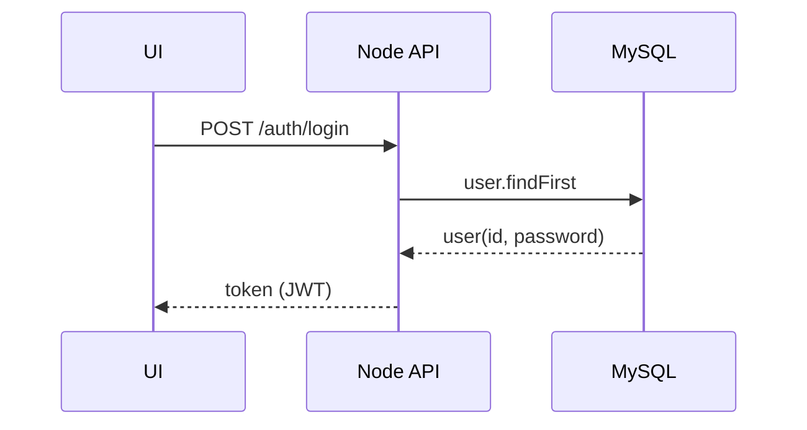
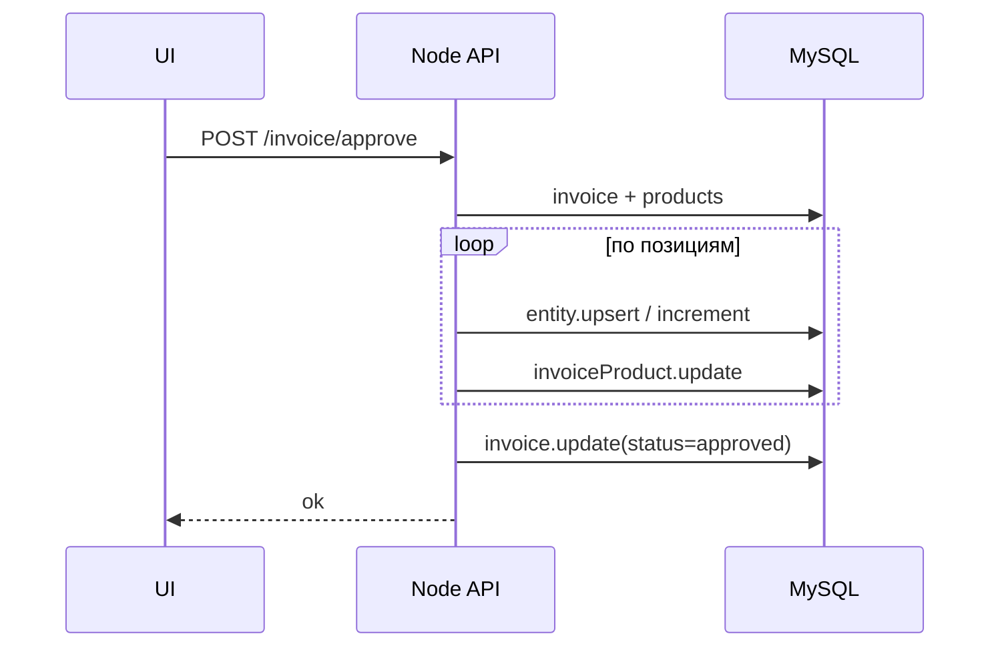
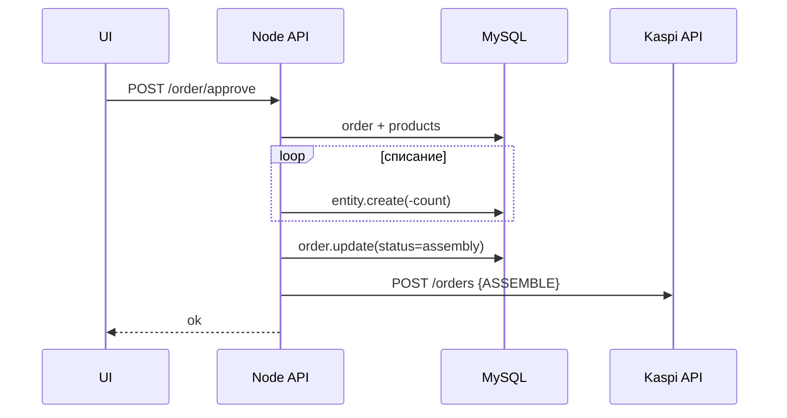

### Диаграммы последовательностей

Авторизация:

```mermaid
sequenceDiagram
  participant UI
  participant API as Node API
  participant DB as MySQL
  UI->>API: POST /auth/login
  API->>DB: user.findFirst
  DB-->>API: user(id, password)
  API-->>UI: token (JWT)
```

Утверждение накладной:

```mermaid
sequenceDiagram
  participant UI
  participant API as Node API
  participant DB as MySQL
  UI->>API: POST /invoice/approve
  API->>DB: invoice + products
  loop по позициям
    API->>DB: entity.upsert / increment
    API->>DB: invoiceProduct.update
  end
  API->>DB: invoice.update(status=approved)
  API-->>UI: ok
```

Сборка заказа и Kaspi нотификация:

```mermaid
sequenceDiagram
  participant UI
  participant API as Node API
  participant DB as MySQL
  participant Kaspi as Kaspi API
  UI->>API: POST /order/approve
  API->>DB: order + products
  loop списание
    API->>DB: entity.create(-count)
  end
  API->>DB: order.update(status=assembly)
  API->>Kaspi: POST /orders {ASSEMBLE}
  API-->>UI: ok
```

