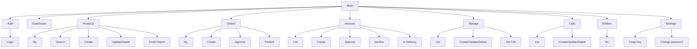

### Sitemap (JetQor)

```mermaid
flowchart TD
  A[Main] --> AU[Auth]
  A --> D[Dashboard]
  A --> P[Products]
  A --> O[Orders]
  A --> I[Invoices]
  A --> S[Storage]
  A --> C[Cells]
  A --> E[Entities]
  A --> ST[Settings]

  AU --> AU1[Login]
  P --> P1[My]
  P --> P2[Search]
  P --> P3[Create]
  P --> P4[Update/Delete]
  P --> P5[Excel Import]
  O --> O1[My]
  O --> O2[Create]
  O --> O3[Approve]
  O --> O4[Packed]
  I --> I1[List]
  I --> I2[Create]
  I --> I3[Approve]
  I --> I4[Decline]
  I --> I5[In Delivery]
  S --> S1[List]
  S --> S2[Create/Update/Delete]
  S --> S3[Set Cell]
  C --> C1[List]
  C --> C2[Create/Update/Delete]
  E --> E1[My]
  ST --> ST1[Kaspi key]
  ST --> ST2[Change password]
```

